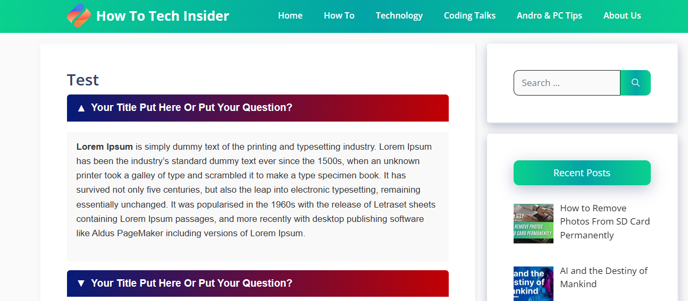
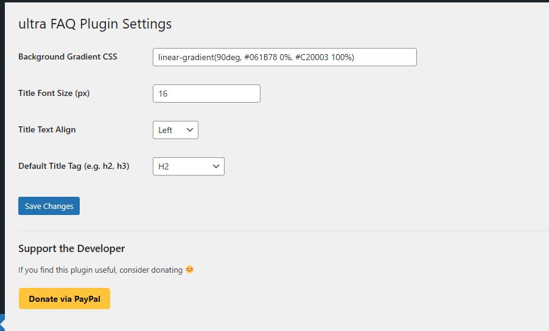

# 💡 Ultra Toggle / FAQ Plugin

A stylish, collapsible FAQ plugin for WordPress with shortcode support, customization options, and a built-in "Buy Me a Coffee" button. Developed with simplicity and flexibility in mind.

---

## 📌 Plugin Info

- **Plugin Name:** Ultra Toggle / FAQ Plugin  
- **Version:** 1.1  
- **Author:** [Sanjib Mondal](mailto:sanjib90511@gmail.com)  
- **License:** GPL v2 or later  
- **Requires at least:** WordPress 4.6+  
- **Tested up to:** WordPress 6.x  

---

## 🧩 Features

- ✅ Easy-to-use `[ultra_according]` shortcode
- 🎨 Fully customizable styles:
  - Background gradient
  - Title font size
  - Title alignment (left, center, right)
  - Heading tag (h2, h3, span, p, etc.)
- 📱 Responsive design
- 💳 Built-in PayPal “Buy Me a Coffee” donation button
- ⚡ Smooth toggle animation using jQuery
- 🛠 Admin panel to manage plugin settings

---

## 🚀 Installation

1. Download the plugin ZIP file from GitHub.
2. In your WordPress dashboard, go to **Plugins → Add New → Upload Plugin**.
3. Upload the ZIP file, install, and activate.
4. Go to **Settings → ultra FAQ Plugin Settings** to configure options.

---

## 📝 Usage

Use the shortcode below to display a FAQ/toggle section:

```php
[ultra_according title="Your Question" heading_tag="h2"]
Your answer content goes here.
[/ultra_according]
```

## ⚙️ Settings Panel

After activating the plugin, go to:  
**WordPress Dashboard > Settings > ultra FAQ Plugin Settings**

Here you can customize the behavior and appearance of your FAQ toggle boxes globally.

### Available Settings:

**🎨 Background Gradient CSS – e.g.,**  
  Customize the background of the toggle title using any CSS gradient or color.  
  _Example:_ `linear-gradient(90deg, #061B78 0%, #C20003 100%)`

**🔠 Title Font Size (px)**  
  Set the font size of the FAQ title (e.g., `16`, `20`, `24`)

**📐 Title Text Align**  
  Choose how the text in the title should be aligned:  
  `left`, `center`, or `right`

**🏷 Default Title Tag**  
  Choose the HTML tag to wrap around your FAQ title. Available options:  
  `h2`, `h3`, `h4`, `span`, or `p`

> 💡 You can override any of these settings directly in the shortcode for specific use cases.

---

## 💰 Support the Developer

- If this plugin has helped you, consider supporting its development.
- You can donate via PayPal:
- 👉 Donate via PayPal
- Or from the plugin settings panel directly.

---

## 🧑‍💻 Contributing

Contributions are welcome!
Fork the repository, make your changes, and submit a pull request.

---
## 📩 Contact

Email: sanjib90511@gmail.com
---
## 📸 Settings Panel Preview

### 1️⃣ Front-End View



### 2️⃣ Settings




